# 第一次作业
* 调查并记录实验环境的如下信息：
  * 当前Linux发行版本基本信息
    使用命令`uname -a`，查询Linux发行版本的基本信息。
  &nbsp;
  * 当前Linux内核版本基本信息
    使用命令`cat /etc/issue`，查询Linux内核版本的基本信息。
  &nbsp;
    
    可以看到左边阿里云的实验环境中和右边虚拟机中的发行版本信息以及内核信息并不相同。
  &nbsp;
* Virtualbox安装完Ubuntu之后新添加的网卡如何实现系统自动启用和自动获取IP
    *  步骤：
    1. 首先使用命令`ifconfig -a`，查询现有的网卡，发现现有的enp0s3是自带的网卡，还可以看到所有的网卡还包括一个enp0s8；再输入命令`ifconfig`可以看到enp0s8现在并没有在工作。
        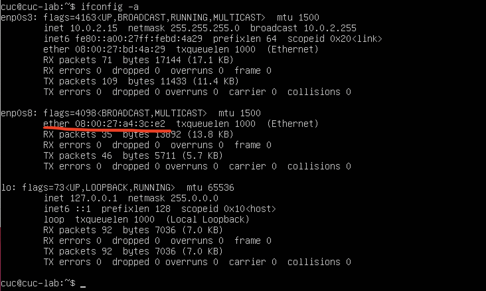
        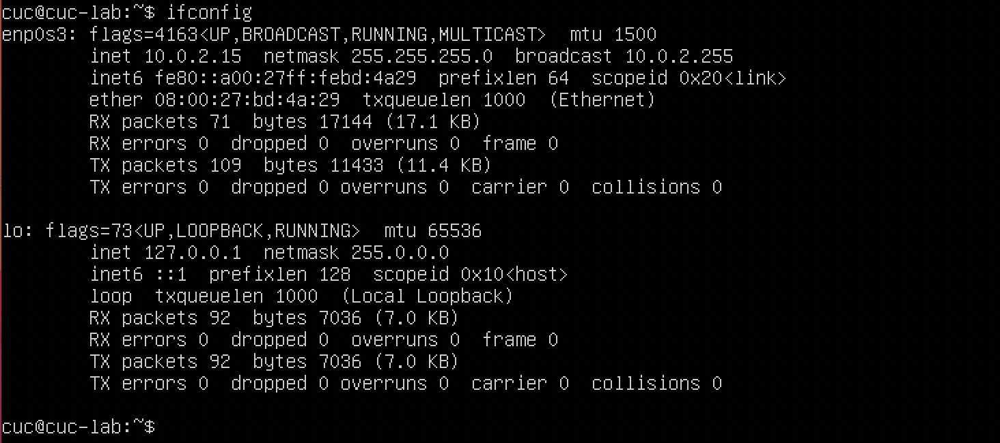
    2. 然后再使用命令`sudo vim /etc/netplan/00-installer-config.yaml`，打开文件添加网卡enp0s8的信息。
        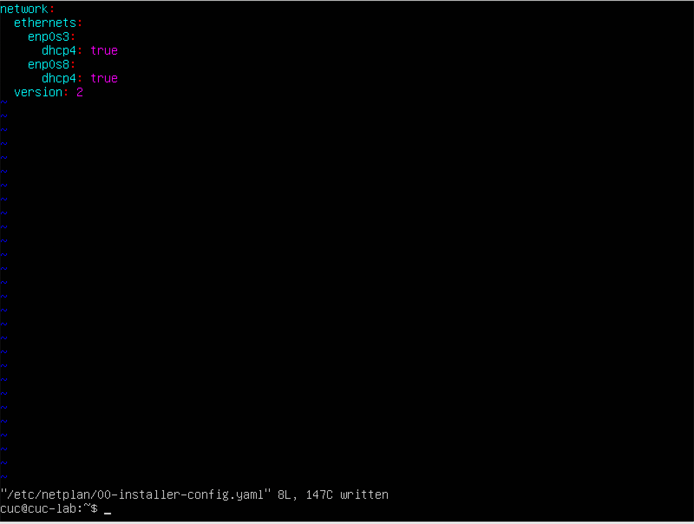

    3. 输入命令`sudo netplan apply`,使刚刚配置的网卡生效。
        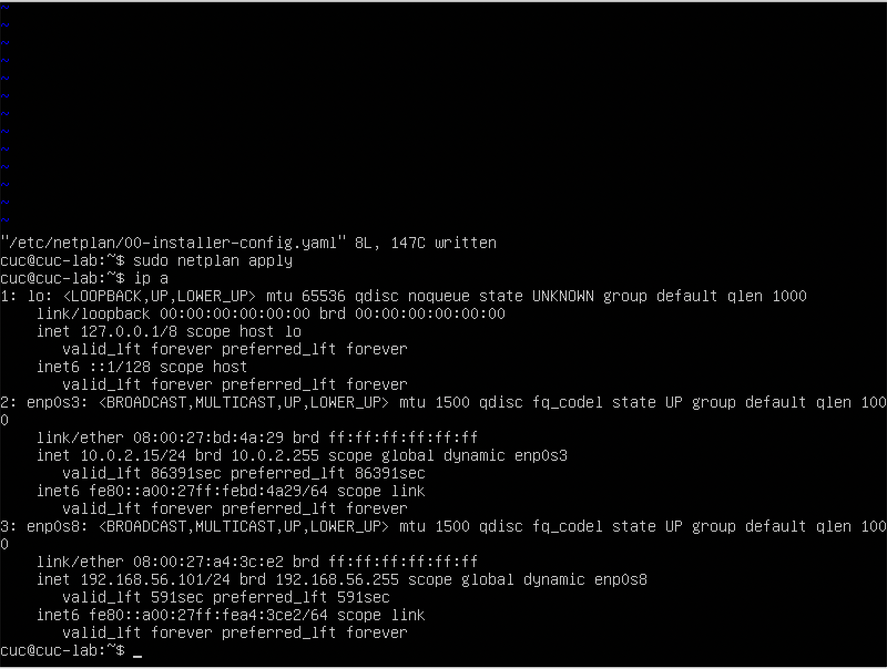
 &nbsp;
    * 遇到的问题和解决方法：
    刚开始导入虚拟机时，每次打开它都会显示类似于 <mark>“网卡2无法连接”</mark> 的报错， <mark>导致无法打开虚拟机</mark> ，于是在"设置"里添加好了网卡2，成功打开虚拟机。
    在完成这一题是，输入命令`ifconfig`时显示两张网卡都在工作中，于是输入命令`sudo vim /etc/netplan/00-installer-config.yaml`， <mark>进入到netplan文件中把enp0s8网卡的内容删去了</mark>，再次输入命令`ifconfig`，如图显示enp0s8分配的ip地址消失了，于是误以为已经将这张网卡关闭。
    
    后来在畅课看讨论区里的内容看到同学发帖，老师给的回复显示这种方法只能停止了<mark>网络层</mark>，而并没有影响<mark>物理层</mark>和<mark>数据链路层</mark>。于是打开Bing查阅资料，查阅到以下资料可以关闭和打开网卡<https://blog.csdn.net/DDJ_TEST/article/details/115459850>
    于是输入命令`sudo ifconfig enp0s8 down`，运行后再次输入`ifconfig`命令，显示enp0s8消失了，应该是已经让它停止运行了。
    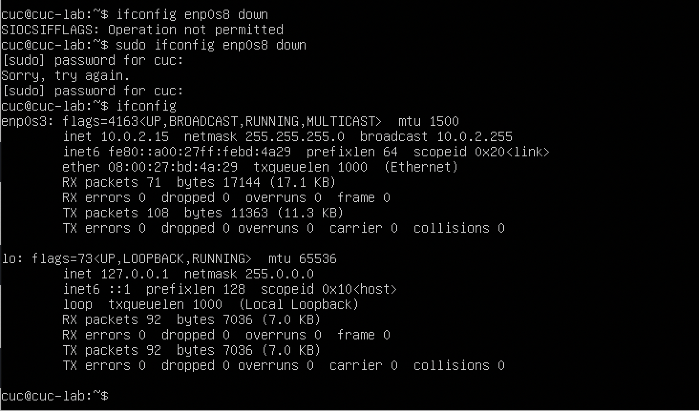
  &nbsp;
* 如何使用scp在「虚拟机和宿主机之间」、「本机和远程Linux系统之间」传输文件？
    * 步骤：
   在「虚拟机和宿主机之间」
   1. 先在虚拟机中<mark>创建文件夹xr</mark>，然后<mark>查询文件夹xr的路径</mark>，之后随便选择一个文件，在本地输入命令`scp ~/Desktop/PPT.pptx cuc@192.168.56.101:/home/cuc/xr`，宿主机显示已成功传输，<mark>再在虚拟机中查询文件夹xr，发现文件夹中已经有了PPT.pptx</mark>。
    
    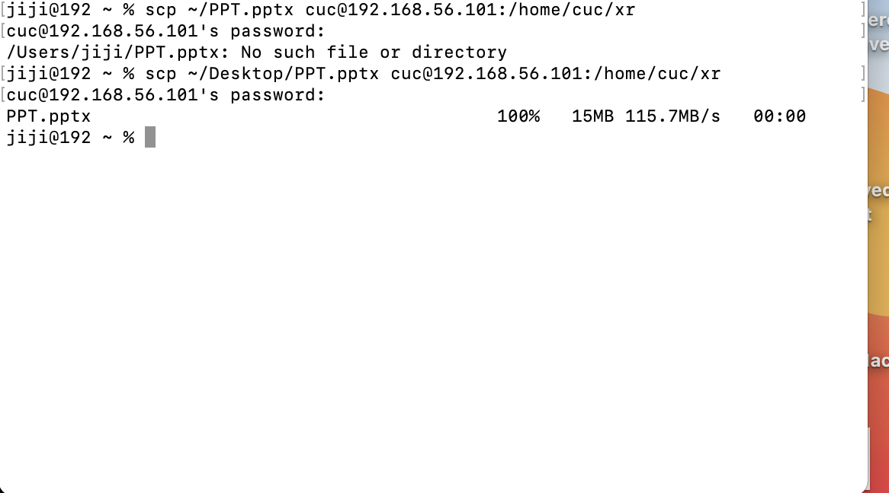
    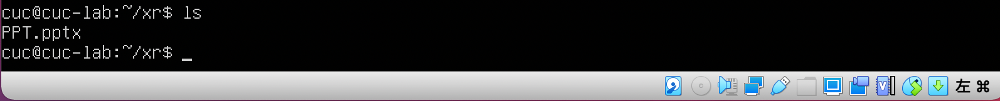
&nbsp;
   2. 再把文件从虚拟机传输到宿主机，输入命令`scp cuc@192.168.56.101:/home/cuc/xr/PPT.pptx ~/Desktop`
   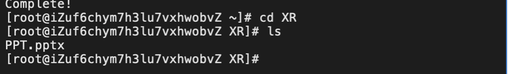
   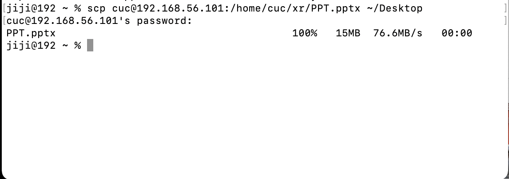
   在「本机和远程Linux之间」
   1. 基于宿主机和虚拟机之间互传文件的基础，继续互传PPT.pptx这个文件。首先先从本机传文件给远程Linux系统，方法和从宿主机传输文件给虚拟机方法一样。
   2. 再从远程Linux传文件给本机，首先==要先实现本机远程登录==
   
   
   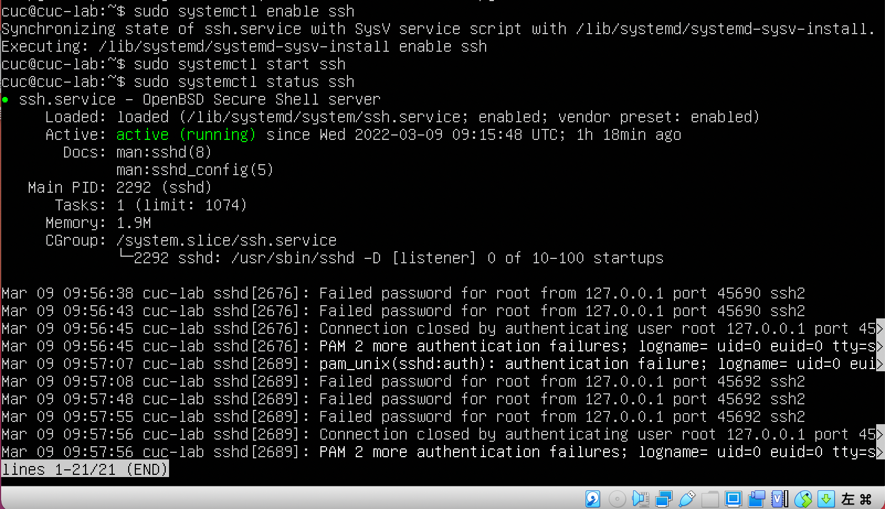
   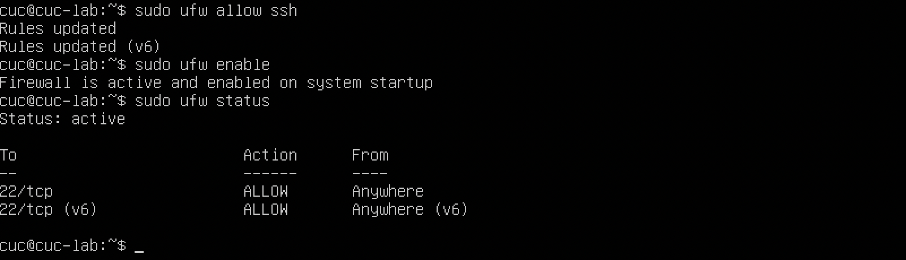
   &nbsp;
   然后在本地输入命令`ssh cuc@192.168.56.101`
   &nbsp;
   
   &nbsp;
   即可实现本地远程登录Linux。
   再使用远程Linux传输文件，输入命令`scp ~/xr/PPT.pptx cuc@192.168.56.101:~/Desktop`
   &nbsp;
   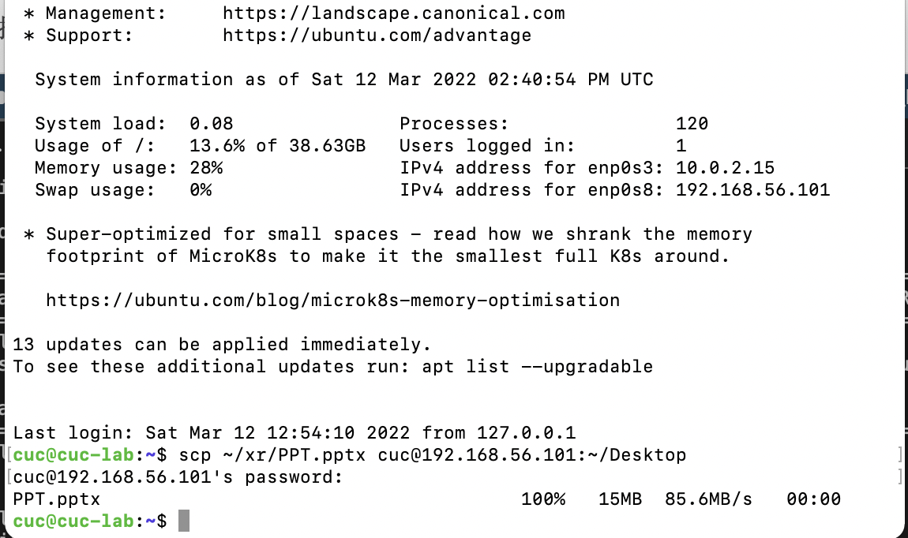
   如图显示成功！
  &nbsp;

* 如何配置SSH免密登录？
    * 步骤：
    1. 首先在本地终端里输入`ssh-keygen -t rsa`，<mark>生成密钥对</mark>（这一步骤忘记截图了）
    2. 然后输入命令`ssh-copy-id cuc@192.168.56.101`，将生成的公钥传到虚拟机中。
    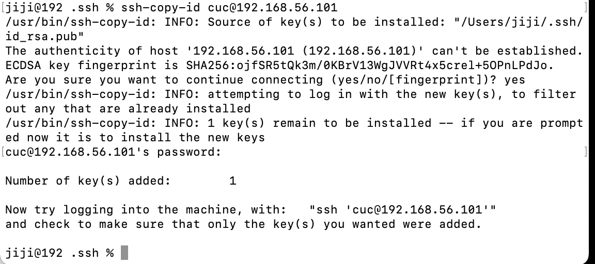
    1. 然后重启ssh服务，再次输入命令`ssh cuc@192.168.56.101`，验证是否成功实现免密登陆。
    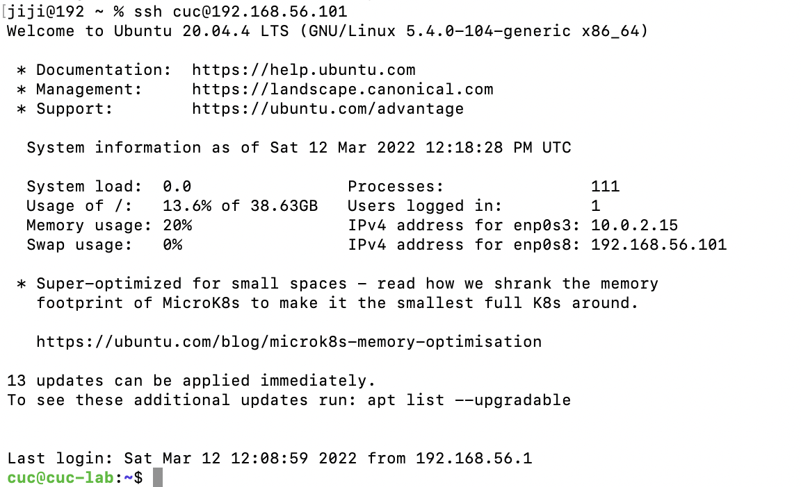
    如图显示，已经成功实现。
    * 遇到的问题和解决方法：
      * 按照以上步骤做完之后，重启ssh服务，发现依旧需要秘密才能登陆，首先怀疑是`ssh-copy-id`失效,但是经过验证发现并不是这里的问题。
      * 于是再次执行以上步骤，发现在输入`ssh-copy-id cuc@192.168.56.101`这一命令后，出现这样一行提示<mark>attempting to log in with the new key(s), to filter out any that are already installed</mark>(之前也出现过但是并没有注意)，在google上搜索后得知<mark>这段提示的意思是指已经密钥发生了改变，无法复制</mark>。根据指示，需要先将原key删除，输入命令`ssh-keygen -R 192.168.56.101`可以远程删除key，出现如图所示的提示则表示成功删除！
      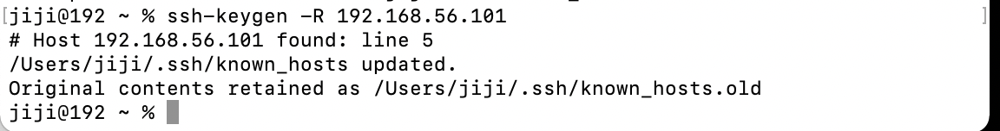
      删除后再重新使用`ssh-keygen`生成新的密钥对，执行之后的步骤，成功实现免密登陆。

    
